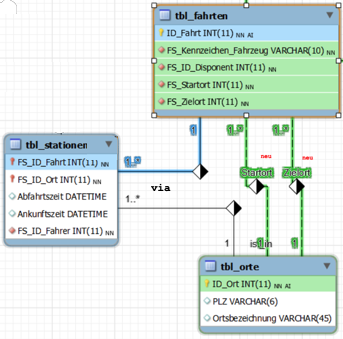
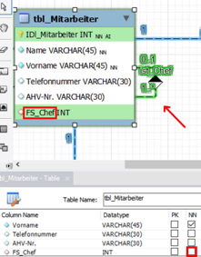
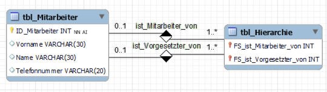
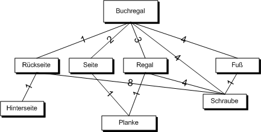

# Zusammenfassung
### Mehrfachbeziehungen
Bei Mehrfachbeziehungen existieren mehrere unabhängige Beziehungen zwischen zwei Tabellen – jede repräsentiert einen anderen Sachverhalt – und sie müssen eindeutig beschriftet werden. Ein Beispiel ist eine mc
zwischen tbl_Fahrten und tbl_Orte, die eine Transformationstabelle erfordert.

### Rekursion
Rekursion betrifft Beziehungen innerhalb derselben Tabelle – ein Datensatz steht zu einem anderen derselben Tabelle in Beziehung. In einer Firmenhierarchie hat jede Person genau einen Vorgesetzten (c
) – die oberste Person hat NULL als Fremdschlüssel. Bei mehreren Vorgesetzten (Netzwerkstruktur) wird eine mc
und eine Transformationstabelle benötigt.

### Einfache Hierarchie
Eine einfache Hierarchie in derselben Tabelle – jedes Element hat maximal ein Oberelement – erfordert einen Fremdschlüssel, der auf denselben Tabellenschlüssel verweist. Das Wurzelelement hat NULL als Fremdschlüssel (c
). Bei mehreren Oberelementen wird eine mc
und eine Transformationstabelle benötigt.

### Stücklistenproblem
Das Stücklistenproblem betrifft Produkte, die aus anderen Produkten zusammengesetzt sind – alle Teile sind in derselben Tabelle. Ziel ist eine Liste aller Einzelteile – eine zusätzliche Tabelle zeigt, welche Komponenten in welche Aggregate fließen und in welcher Menge.
